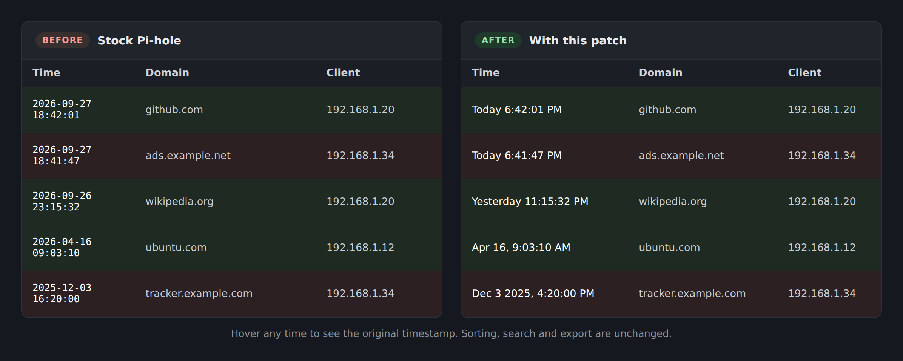

# Pi-hole Time Format Patch

**Makes Pi-hole's Query Log easy to read at a glance.**
Timestamps like `2026-09-27 18:42:01` become **Today 6:42:01 PM**.



- Shows **Today**, **Yesterday**, or the date, with a 12-hour clock
- Hover any time to see the original timestamp
- Sorting, search and export work exactly as before
- **Windows:** double-click, press 1. **Pi:** paste one line.
- Undo just as easily
- For **Pi-hole v6** (tested on web interface v6.5)

---

## Install

Pick whichever you prefer. Both do exactly the same thing.

### Option 1: Windows (no command line)

1. **[Download pihole-time-format.bat](https://github.com/Mythodix/pihole-time-format/releases/latest/download/pihole-time-format.bat)**
   (or get everything with the green **Code** button › **Download ZIP**)
2. **Double-click it.** If Windows shows a security warning, click **Run**
   (or **More info › Run anyway**).
3. **The first time,** type your Pi's IP address and username, then your Pi
   password. It remembers the address and username for next time.
4. **Press 1** to apply the patch.
5. Open the Pi-hole **Query Log** and press **Ctrl+F5**.

```
   ==================================================
      Pi-hole Time Format Patch
   ==================================================

     Pi:        pi@192.168.1.50
     Sign-in:   password each time

     [1]  Apply the patch
          Run this again after every Pi-hole update.

     [2]  Undo the patch
     [3]  Check status
     [4]  Stop asking for my password
     [5]  Change Pi or username
     [6]  Exit
```

### Option 2: On the Pi (one line)

Log into your Pi and paste:

```bash
curl -fsSL https://raw.githubusercontent.com/Mythodix/pihole-time-format/main/pihole-time-format.sh | sudo bash -s apply
```

Then open the Pi-hole **Query Log** and press **Ctrl+F5**.

<details>
<summary><b>How do I log into my Pi?</b></summary>

<br>

From another computer on your network, open a terminal
(**Windows Terminal** or **Command Prompt** on Windows, **Terminal** on Mac)
and type:

```bash
ssh pi@192.168.1.50
```

Replace `pi` with your Pi's username and `192.168.1.50` with its IP address
(it's shown on the Pi-hole dashboard). Type your Pi password when asked, then
paste the install line.

</details>

---

## After a Pi-hole update

Pi-hole updates put the old timestamps back. Put yours back the same way:

- **Windows:** double-click `pihole-time-format.bat` and press **1**.
- **On the Pi:** run the install line again.

Then press **Ctrl+F5** on the Query Log.

---

## Undo

- **Windows:** double-click `pihole-time-format.bat` and press **2**.
- **On the Pi:**

  ```bash
  curl -fsSL https://raw.githubusercontent.com/Mythodix/pihole-time-format/main/pihole-time-format.sh | sudo bash -s restore
  ```

This puts Pi-hole's original file back exactly as it was.

---

## Questions

<details>
<summary><b>Is it safe?</b></summary>

<br>

It changes one display setting in one file of Pi-hole's web page. It doesn't
touch blocking, DNS, your settings or your lists. A backup of the original
file is saved first, and if anything goes wrong while patching, the original
is left untouched. The whole script is
[one readable file](pihole-time-format.sh) if you'd like to check it before
running it.

</details>

<details>
<summary><b>Can the Windows version stop asking for my password?</b></summary>

<br>

Yes. Choose **4 · Stop asking for my password** from the menu once. It sets
up an SSH key and a rule on the Pi that lets only this patch run without a
password. Read the [security note](#security-note) first; only do this on
your own Pi.

</details>

<details>
<summary><b>Where does the Windows version save my details?</b></summary>

<br>

Your Pi's address and username are saved in
`%APPDATA%\pihole-time-format\settings.cmd`. Your password is never saved.
To change them, choose **5 · Change Pi or username** from the menu, or delete
that folder to start fresh.

</details>

<details>
<summary><b>Which Pi-hole versions does it work with?</b></summary>

<br>

Pi-hole v6. It was tested on web interface v6.5 (Core v6.4.2, FTL v6.6.2).
Check yours with `pihole -v`. If a future update changes things too much,
the script stops and tells you, without changing anything.

</details>

<details>
<summary><b>It said "Already patched" but I still see the old times</b></summary>

<br>

Your browser is showing a saved copy of the page. Press **Ctrl+F5** on the
Query Log tab (**Cmd+Shift+R** on a Mac).

</details>

<details>
<summary><b>It said "Could not find the Time column" or "Patchable: NO"</b></summary>

<br>

A Pi-hole update has changed the Query Log's code and this patch needs
updating to match. Nothing was changed on your Pi. Please
[open an issue](https://github.com/Mythodix/pihole-time-format/issues)
with the output of `pihole -v`.

</details>

<details>
<summary><b>I'd rather download it than pipe it into bash</b></summary>

<br>

On the Pi:

```bash
curl -fsSL https://raw.githubusercontent.com/Mythodix/pihole-time-format/main/pihole-time-format.sh -o ~/pihole-time-format.sh
less ~/pihole-time-format.sh                  # read it first if you like (q to quit)
sudo bash ~/pihole-time-format.sh apply
```

Other commands: `sudo bash ~/pihole-time-format.sh restore` to undo, and
`bash ~/pihole-time-format.sh status` to check whether it's patched.

</details>

---

## More

<details>
<summary><b>Troubleshooting</b></summary>

<br>

**"Permission denied"** — wrong password, or the wrong username. On Windows,
choose **5 · Change Pi or username** to fix the saved details.

**"Could not resolve hostname" or "Connection timed out"** — wrong Pi
address, or the Pi is off. Use the IP address shown on the Pi-hole
dashboard.

**"queries.js not found"** — Pi-hole's web files are somewhere unusual.
Find them with `sudo find / -path '*scripts/js/queries.js' 2>/dev/null`,
then run
`sudo PIHOLE_QUERIES_JS=/path/to/queries.js bash pihole-time-format.sh apply`.

**"python3: command not found"** — install it with `sudo apt install python3`.

**"ssh is not recognized"** (Windows) — the OpenSSH Client isn't installed.
Add it from **Settings › System › Optional features › Add a feature ›
OpenSSH Client**. It comes with Windows 10 and 11, so this is rare.

**Windows still asks for a password after option 4** — if you already had an
SSH key with a passphrase, Windows asks for that instead. Delete
`%USERPROFILE%\.ssh\id_ed25519` and its `.pub` file, then run option 4
again.

**"Getting the latest patch script from GitHub" fails** (Windows) — your Pi
can't reach the internet. Download the whole project instead (green **Code**
button › **Download ZIP**), extract it, and run the `.bat` from that folder;
it will upload the script from your PC.

**"bash\r: No such file or directory"** — the script was saved with Windows
line endings. Fix it on the Pi with `sed -i 's/\r$//' ~/pihole-time-format.sh`.

**The Query Log looks broken** — run the [Undo](#undo) line. If there's no
backup, `sudo pihole -r` (Repair) reinstalls Pi-hole's original web files.

</details>

<details>
<summary><b>How it works</b></summary>

<br>

The Query Log's Time column is drawn by a small JavaScript function in
`/var/www/html/admin/scripts/js/queries.js`, which formats each timestamp as
`YYYY-MM-DD HH:mm:ss`. The script:

1. Saves a copy of that file as `queries.js.orig`.
2. Replaces just the Time column's display function with one that shows
   Today / Yesterday / date labels.
3. Marks the file with `// PI-HOLE-TIME-FORMAT-PATCHED` so it knows it's
   been patched.
4. Keeps the file's original owner and permissions.

The patched copy is written to a temporary file and only moved into place if
every step worked. The new function only changes what's displayed; sorting,
search and export still use the raw timestamp.

Pi-hole updates replace `queries.js`, which is why the patch has to be run
again after updating.

</details>

<details id="security-note">
<summary><b>Security note (Windows option 4 only)</b></summary>

<br>

**4 · Stop asking for my password** adds a rule at
`/etc/sudoers.d/pihole-timeformat` that lets your account run
`~/pihole-time-format.sh` as root without a password, and nothing else. Your
account can edit that file, so anything written into it would also run as
root. On a home Pi where you already have `sudo`, that adds nothing new.
**Don't use it on a Pi other people log into.**

It also creates an SSH key without a passphrase (or uses your existing one),
so anyone who can use your Windows account could log into the Pi.

The rule is checked with `visudo` before it's installed, so a mistake can't
lock you out of `sudo`. No passwords are stored anywhere.

</details>

<details>
<summary><b>Full uninstall</b></summary>

<br>

On the Pi:

```bash
curl -fsSL https://raw.githubusercontent.com/Mythodix/pihole-time-format/main/pihole-time-format.sh | sudo bash -s restore
sudo rm -f /var/www/html/admin/scripts/js/queries.js.orig
rm -f ~/pihole-time-format.sh
```

If you used Windows option 4 (Stop asking for my password), also run:

```bash
sudo rm /etc/sudoers.d/pihole-timeformat
sed -i '/pihole-time-format$/d' ~/.ssh/authorized_keys
```

The second line removes only keys the setup created. If it reused a key you
already had, remove that one by hand with `nano ~/.ssh/authorized_keys` if
you want to.

On Windows, delete the `%APPDATA%\pihole-time-format` folder to remove the
saved Pi address and username. Paste that path into File Explorer's address
bar to find it.

</details>

---

Found a problem? [Open an issue](https://github.com/Mythodix/pihole-time-format/issues)
and include the output of `pihole -v`.

[MIT License](LICENSE) · Not affiliated with the Pi-hole project.
